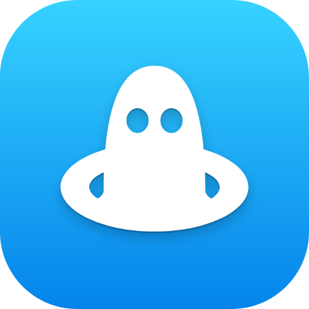

  

# MergeMole

MergeMole is a menu bar app that triages your pull requests with AI. It pulls every PR that needs your attention into one list and ranks each by priority and effort, with a one-line summary of what it does. It's free, and by default your code never leaves your Mac.

> [!NOTE]
> On-device AI triage requires macOS 26 (Tahoe) on an Apple Silicon Mac with Apple Intelligence. On macOS 15, bring your own model or use MergeMole as a fast, plain PR organizer.

## Install

Download the latest release [here](https://github.com/Awhalen1999/merge-mole/releases/latest) or from [mergemole.app](https://mergemole.app), open the DMG, and move MergeMole into your `Applications` folder.

You'll need a GitHub personal access token (scopes: `repo`, `read:org`). MergeMole walks you through creating one on first launch.

## Features

- [x] Every PR waiting on you in one list: review requested, assigned, created, mentioned, and reviewed
- [x] AI triage: priority and effort ratings, plus a one-line summary of each PR
- [x] Custom tabs: turn any GitHub search into a tab of your own
- [x] Review state, CI checks, merge conflicts, and size at a glance
- [x] Unread tracking: the menu bar count shows what's new and empties as you catch up
- [x] PRs re-surface when something meaningful changes: new commits, CI flips, reviews
- [x] Launch at login and automatic updates

## AI options

- **On-device (default):** runs locally with Apple's Foundation Models. Free, and nothing leaves your Mac.
- **Bring your own:** connect an OpenAI-compatible, Anthropic, or local (Ollama) endpoint with your own key.
- **Off:** use it as a fast, plain PR organizer.

PR diffs are never sent to any AI. Triage runs on metadata only.

## Privacy

Your GitHub token and any AI keys stay in the macOS Keychain. No account, no telemetry, no backend. The app talks only to GitHub and the AI endpoint you choose.

## Why does on-device AI need macOS 26?

MergeMole's on-device triage is built on Apple's Foundation Models framework, which ships with macOS 26 and needs an Apple Silicon Mac with Apple Intelligence enabled. Everything else in the app works on macOS 15, where you can pair it with your own model or run triage off.

## Contributing

Issues are welcome. ❤️

## License

MergeMole is available under the [MIT license](LICENSE).
